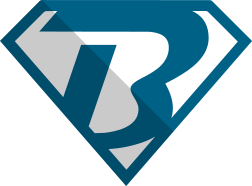

<h1>Emir Baručija</h1>

<h3>Frontend Developer at Commerce Care d.o.o. - DACH</h3>
<h3>Software engineering student</h3>
<h3>Bosnia & Herzegovina Futures Foundation scholar</h3>

21 years old software engineering student.

Determined, organized and great team player.

Open to any cooperation, suggestions or criticism.

<h2>Social media</h2>

Emir Barucija<a href="https://www.emirbarucija.com"> Portfolio</a>

Emir Barucija<a href="https://www.linkedin.com/in/emirbarucija/"> Linkedin </a>Profile

Emir Barucija<a href="https://www.instagram.com/emirbarucija"> Instagram </a>Profile

 

<!--
**barucija/barucija** is a ✨ _special_ ✨ repository because its `README.md` (this file) appears on your GitHub profile.

Here are some ideas to get you started:

- 🔭 I’m currently working on ...
- 🌱 I’m currently learning ...
- 👯 I’m looking to collaborate on ...
- 🤔 I’m looking for help with ...
- 💬 Ask me about ...
- 📫 How to reach me: ...
- 😄 Pronouns: ...
- ⚡ Fun fact: ...
-->
